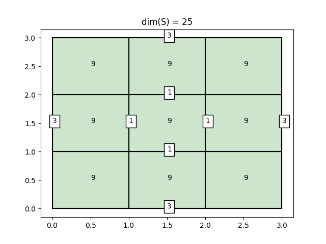
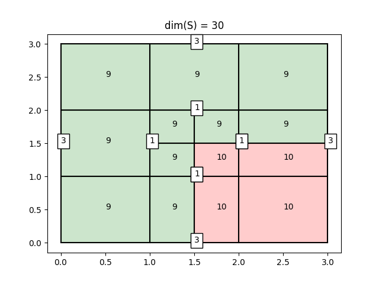
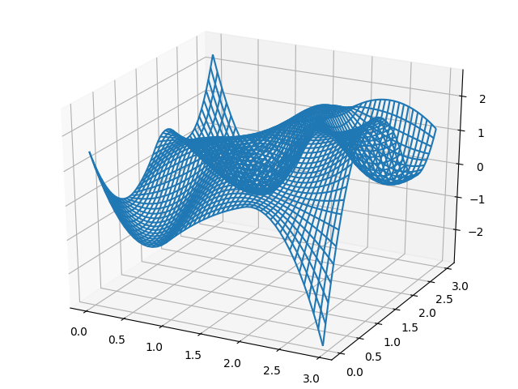

# LR Splines
#### An LR-Spline implementation written in Python.

This aim of Python library is to provide a lightweight framework for understanding
LR-splines. The library is in no shape or form optimized for high performance computing, but is rather aimed
at being a small toolkit for gaining some intuition for LR-splines. For more industrial grade
performance and a more complete set of tools, see the [GoTools library](https://github.com/SINTEF-Geometry/GoTools) written in C++.

Other LR-spline-related projects:

1. [LRSplines](https://github.com/VikingScientist/LRsplines): A C++ library which some of the code in this repository is based on. 
2. [LRSplines: Android App](https://github.com/VikingScientist/LR-introduction): An app for interactive demonstration of the LR-spline refinement procedure.

### Introduction

The need for adaptive refinement techniques is evident when it comes to optimizing the tradeoff between computational cost
and computational accuracy. When utilizing spline spaces with an underlying tensor-product structure,
refinement of a mesh induces a global propagation of the newly introduced meshlines to the whole mesh. This can be
very inefficient. The concept of LR-Splines was introduced in 2013 in the paper [Polynomial splines over locally refined box-partitions](https://www.sciencedirect.com/science/article/pii/S0167839613000113),
and can be seen as an attempt to remedy this aforementioned problem.
LR-Splines have several desirable properties:

1. They form a non-negative partition of unity by construction.
2. Linear independence (under some conditions on the refinement).

### Construction

LR-splines are construced by starting with an initial **tensor product** spline space. Meshlines are then inserted one at the time,
making sure the line **completely traverses** the support of at least one B-spline.

This B-spline is then **split** according to the standard knot insertion procedure, producing two new B-splines.
These new B-splines are subsequently tested against **all previously existing meshlines**, to check for further splitting.

### Installation

Download the repository and run:
```bash
    python setup.py install
```

Verify the installation by running:
```bash
    python -m import LRSplines
```
 
### Basic Usage

The central object in the LRSplines-package is the LRSpline object.
We initialize an LRSpline at the tensor-product level by specifying two knot vectors, and corresponding polynomial degrees.
The following code initializes a biquadratic LR-spline. 

#### Initialization and mesh visualization

```python
import LRSplines

du = 2
dv = 2
knots_u = [0, 0, 0, 1, 2, 3, 3, 3]
knots_v = [0, 0, 0, 1, 2, 3, 3, 3]

LR = LRSplines.init_tensor_product_LR_spline(du, dv, knots_u, knots_v)
```

We can at any stage visualize the LR-mesh which underlies a given LR-spline, as seen:

```python
LR.visualize_mesh()
```
yielding the image



Here, each **element** of the mesh displays the number of supported B-splines. In this case there are nine supported B-splines on
each element. The green color indicates that the element is not **overloaded**. Each meshline displays its **multiplicity**
indicated by a number in a white box. As we can see, the boundary mesh-lines have multiplicity 3, which reflects the knot
vectors we chose. The dimension of the spline space is displayed at the top. In this case, we have five basis splines in each direction, totaling 25
tensor product B-splines.

#### Meshline insertion

We can insert mesh-lines into the mesh by creating a new Meshline object. In this example, we insert a meshline
between the points (1.5, 0) and (1.5, 2) and between the points(1, 1.5) and (3, 1.5). 
This is represented in Python as:

```python
m1 = LRSplines.Meshline(start=0, stop=2, constant_value=1.5, axis=0)
m2 = LRSplines.Meshline(start=1, stop=3, constant_value=1.5, axis=1)
```

The `axis` parameter determines the direction of the meshline, i.e., 0 for vertical and 1 for horizontal.
We insert this meshline into the LR-spline, and visualize the result.

```python
LR.insert_line(m1)
LR.insert_line(m2)
LR.visualize_mesh()
```

This yields the following image:

As we can see, some of the elements have turned red, indicating that they are now overloaded, which may result in loss of linear independence.

    
#### Evaluation

We can at any stage evaluate the LR-spline. At the moment there is no clever functionality for setting
the coefficients of the underlying B-splines, but we can do so explicitly by looping over the set of basis functions
`LR.S`.

```python
import numpy as np
import matplotlib.pyplot as plt
from mpl_toolkits.mplot3d import Axes3D

# set the coefficients explicitly
for b in LR.B:
    b.coefficient = np.random.random(-3, 3)

N = 20
x = np.linspace(knots_u[0], knots_u[-1], N)
y = np.linspace(knots_v[0], knots_v[-1], N)
z = np.zeros((N, N))
X, Y = np.meshgrid(x, y)

for i in range(N):
    for j in range(N):
        z[i, j] = LR(x[i], y[j])

fig = plt.figure()
axs = Axes3D(fig)
 
axs.plot_wireframe(X, Y, z) # or plot_surface

```

This gives the resulting surface:

